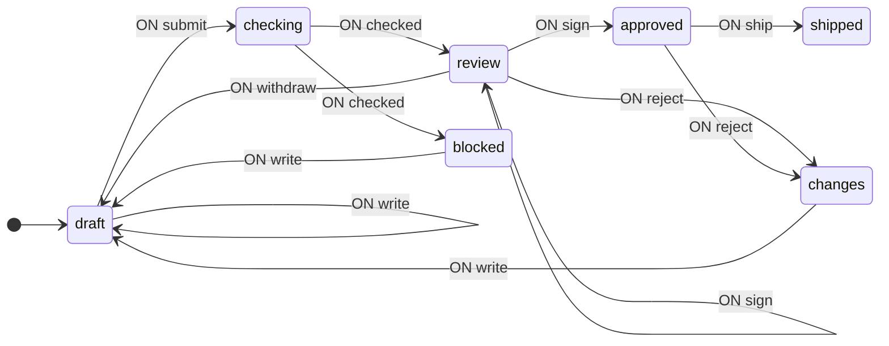
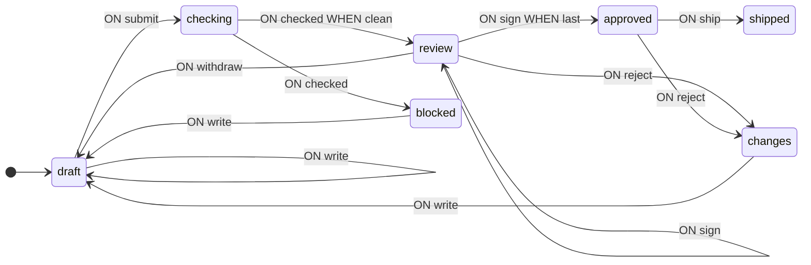
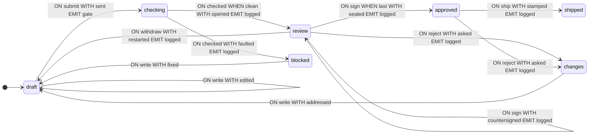

**English** · [Русский](README.ru.md)

# Schema Review

A complete walkthrough from problem statement to a working state machine: a change moving through review — an automated gate, then two sign-offs, then it ships. The thing under review is itself a state-machine schema, checked by the library's own `validate` and `analyze`. The sections follow the order of work — first the transition graph, then context, guards and operations, then the gate, the page and the analysis. In the code, type definitions are usually placed before the schema, but here they are introduced as needed.

Notation and definitions are given in the [guide](https://github.com/evgkch/fsmjs/blob/master/README.md). References of the form “section 4.3” point to sections of this document; the guide is referenced by section title — “README, “Transition schema””.

**Working project.** The example runs as a page — [live demo](https://evgkch.github.io/fsmjs/review/). Vite, plain HTML and TypeScript, no frameworks; the commands are run from the root of this repository:

```sh
npm install
npm run dev       # http://localhost:5173/review/
npm run build     # tsc --noEmit + build to dist/
```

Correspondence between files and sections of the document:

| File                               | Sections                                            |
| ---------------------------------- | --------------------------------------------------- |
| [`src/types.ts`](src/types.ts)     | 2.1, 3 — states, events, context                    |
| [`src/machine.ts`](src/machine.ts) | 4, 5 — guards, operations, schema                   |
| [`src/gate.ts`](src/gate.ts)       | 6 — the automated check                             |
| [`src/main.ts`](src/main.ts)       | 7 — the page, the buttons, the wait                 |

**Contents**

1. [Problem statement](#1-problem-statement)
2. [Transition graph](#2-transition-graph)
3. [Context](#3-context)
4. [Guards](#4-guards)
5. [Operations](#5-operations)
6. [The gate](#6-the-gate)
7. [Interaction from the browser](#7-interaction-from-the-browser)
8. [Machine run](#8-machine-run)
9. [Schema analysis](#9-schema-analysis)

## 1. Problem statement

The task: a change goes through review. A machine checks it first, then two people sign off on it, then it ships. The submission under review is a state-machine schema — the library is being used to check documents written in its own language.

Workflows like this are usually written as one record and a status string: a `submission` object with every field the whole pipeline could ever have, and a `status` that says which of them are meant to be present. That shape repeats the same bug. A document that is `shipped` and still carries an open fault list, or `blocked` with a signature on it — nothing prevents either, because the record holds every field and the string says nothing about them.

The fix is to make the phase a state and give each state exactly the fields that phase has. The compiler then refuses what the workflow used to permit by accident: a field in a phase that does not own it simply does not type.

## 2. Transition graph

### 2.1 States and events

Table 1 — Machine states

| State      | Meaning                                        |
| ---------- | ---------------------------------------------- |
| `draft`    | Being written; can be edited and submitted     |
| `checking` | Sent to the gate, waiting on it                |
| `blocked`  | The gate refused it; being fixed               |
| `review`   | The gate passed; collecting sign-offs          |
| `changes`  | A reviewer asked for changes; being answered   |
| `approved` | The quorum is reached; ready to ship           |
| `shipped`  | Out. Nothing can happen to it                  |

There are seven input events: `write` with the new text, `submit`, `checked` with the gate's answer, `sign` with the name of the signer, `reject` with who and why, `ship`, and `withdraw`. There are two output events: `gate` with the text to check, and `logged` with one line for the activity feed.

```ts
import type { IState, IEvent, Merge } from "@evgkch/fsmjs";

// Pure states without context.
type Q = IState<
  "draft" | "checking" | "blocked" | "review" | "changes" | "approved" | "shipped"
>;

type Σ = Merge<
  | IEvent<"write", string>
  | IEvent<"submit">
  | IEvent<"checked", Report>
  | IEvent<"sign", string>
  | IEvent<"reject", { who: string; why: string }>
  | IEvent<"ship">
  | IEvent<"withdraw">
>;

type Λ = Merge<
  IEvent<"gate", { text: string }> | IEvent<"logged", { line: string }>
>;
```

The types `Ticket`, `Fault`, `Report` and `Sign` will be introduced in section 3, when the context appears.

### 2.2. First schema

There is no executable code (functions) in it yet — only the structure of states and transitions.

```ts
import type { Schema } from "@evgkch/fsmjs";

const draft = {
  draft: {
    write: [{ to: "draft" }],
    submit: [{ to: "checking" }],
  },
  checking: {
    checked: [{ to: "review" }, { to: "blocked" }],
  },
  blocked: {
    write: [{ to: "draft" }],
  },
  review: {
    sign: [{ to: "approved" }, { to: "review" }, { to: "review" }],
    reject: [{ to: "changes" }],
    withdraw: [{ to: "draft" }],
  },
  changes: {
    write: [{ to: "draft" }],
  },
  approved: {
    ship: [{ to: "shipped" }],
    reject: [{ to: "changes" }],
  },
  shipped: {},
} satisfies Schema<Q, Σ, Λ>;
```

Two rules in the pair `checking` + `checked` correspond to the gate's two answers — pass into `review` or refuse into `blocked` — and three rules in the pair `review` + `sign` to three signatures: the one that completes the quorum, one already given, and any other. What exactly distinguishes them is not yet written. `shipped` is the end: it has no rules.

The schema is already executable: the machine transitions between states without performing any calculations.

```ts
import { StateMachine } from "@evgkch/fsmjs";

const walk = new StateMachine<Q, Σ, Λ>(draft, {
  type: "draft",
  context: undefined,
});
walk.dispatch("submit"); // true
walk.state.type; // 'checking'
```

### 2.3. Validation

```ts
import { validate } from "@evgkch/fsmjs/analysis";
import { formatIssues } from "@evgkch/fsmjs/formatters";

console.log(formatIssues(validate(draft, "draft")));
```

```
⚠ warning node "shipped" has no outgoing transitions
✗ error   cell "checked" at "checking": rule 1 has no guard, so the 1 after it can never fire
⚠ warning cell "sign" at "review" repeats the edge to "review"
✗ error   cell "sign" at "review": rule 1 has no guard, so the 2 after it can never fire
```

The two errors point to the same problem: there are multiple rules in a list but no guards, so the first always fires (README, “Transition schema” and “Limitations”). The warning about `shipped` is not a repair to make — a final state with no way out is what it is for (README, “validate”). The duplicate-edge warning is the same problem: two rules in `review` + `sign` both lead to `review`, and with no guard on either they read as the same edge twice.

```ts
import { toMermaid } from "@evgkch/fsmjs/formatters";

toMermaid(draft, { start: "draft", direction: "LR" });
```



The two `review --> review` arrows are the two rules a run cannot tell apart, drawn as the same arrow twice.

## 3. Context

The guards from section 2.3 must tell whether the gate found anything that blocks, and whether this signature is the last one or a repeat. To do that they need the gate's answer and the signatures already given — so context.

```ts
/** What is under review: somebody's schema, as they typed it. */
type Doc = { readonly name: string; readonly text: string };

/** One thing wrong with a submission. */
type Fault = {
  readonly rank: "blocker" | "caution";
  readonly where: string;
  readonly what: string;
};

/** What the gate answered, whole. */
type Report = {
  readonly faults: readonly Fault[];
  readonly size: { states: number; rules: number; reached: number };
};

/** A sign-off: who, and when they gave it. */
type Sign = { readonly who: string; readonly at: number };

/** Something that was raised and has been answered. */
type Closed = {
  readonly round: number;
  readonly by: string;
  readonly what: string;
};

/** The submission itself — the part that survives every phase. */
type Ticket = {
  readonly doc: Doc;
  readonly round: number;
  readonly closed: readonly Closed[];
};
```

A submission is not one object that grows fields as it moves. It is a different object in every phase, and the phase decides which: a list of faults exists only where something is blocked, a list of signatures only where somebody has signed, a timestamp only once it has shipped. The context composition is **different in different states**.

Table 2 — What each state remembers

| State                   | Content                                                              |
| ----------------------- | -------------------------------------------------------------------- |
| `draft`, `checking`     | the ticket — `doc`, `round`, `closed`                                |
| `blocked`               | the ticket plus `faults` — what the gate refused on                  |
| `review`                | the ticket plus `notes` (the cautions) and `signs`                   |
| `changes`               | the ticket plus `asked` (the request) and `by`                       |
| `approved`              | the ticket plus `signs`                                              |
| `shipped`               | the ticket plus `signs` and `at`                                     |

```ts
export type Q = Merge<
  | IState<"draft", Ticket>
  | IState<"checking", Ticket>
  | IState<"blocked", Ticket & { faults: readonly Fault[] }>
  | IState<
      "review",
      Ticket & { notes: readonly Fault[]; signs: readonly Sign[] }
    >
  | IState<"changes", Ticket & { asked: string; by: string }>
  | IState<"approved", Ticket & { signs: readonly Sign[] }>
  | IState<"shipped", Ticket & { signs: readonly Sign[]; at: number }>
>;
```

The persistent part is `Ticket` — the document, which round it is on, and everything that has been settled about it. A phase adds what only that phase has. What is carried through is written once, in `Ticket`, and what is temporary cannot outlive the phase that owns it.

A single record with all fields at once would look shorter, but it would need a `blank` for every phase that does not have a field — an empty fault list, a list of no signatures, a timestamp that has not happened. That is not a harmless convention: it is exactly how a `shipped` document ends up with an open fault list. The state-dependent context rules the placeholder out, because `draft` has no `faults` field to put one in.

`closed` is the field a workflow written as one record would lose first. An item that was raised and answered is *closed*, not deleted: it keeps the round it was raised in and who raised it, and it stays on the ticket for the rest of the ticket's life. If a revision does not really fix it, the next round raises it again, beside the old entry.

This choice has a consequence: a state and its context only make sense together, so the machine returns them as a single value — `flow.state` of type `FsmState` — where `type` narrows the `context` (README, “Creating a machine and the state”).

## 4. Guards

### 4.1. Names in the schema

Guards are written in the rules by function names; their implementations are given in section 4.2.

> [!NOTE]
> Below is a sketch, not a schema that the compiler would accept, and there is no `satisfies` intentionally. Context is tied to the state (section 3): guards read it, and entering a state that stores something without a context function is not allowed. One requires the other, so the full schema only converges in section 5.3 when operations appear. Here we only show where the guard names stand in the rules.

```ts
const guarded = {
  draft: {
    write: [{ to: "draft" }],
    submit: [{ to: "checking" }],
  },
  checking: {
    checked: [{ to: "review", when: clean }, { to: "blocked" }],
  },
  blocked: {
    write: [{ to: "draft" }],
  },
  review: {
    sign: [
      { to: "approved", when: last },
      { to: "review", when: already },
      { to: "review" },
    ],
    reject: [{ to: "changes" }],
    withdraw: [{ to: "draft" }],
  },
  changes: {
    write: [{ to: "draft" }],
  },
  approved: {
    ship: [{ to: "shipped" }],
    reject: [{ to: "changes" }],
  },
  shipped: {},
};
```

The two dead-rule errors are gone, and the repeated edge with them: the guard on the second `sign` rule is what a run now uses to tell it from the third. Validation leaves one finding.

```ts
formatIssues(validate(guarded, "draft"));
```

```
⚠ warning node "shipped" has no outgoing transitions
```

Guard names appear in the diagram because they are taken from the functions themselves (README, “Labels and names”):



### 4.2. Implementation

```ts
const QUORUM = 2;

/** Did the gate find anything that blocks. Cautions do not — they go to the reviewers. */
function clean(_c: Ticket, report: Report): boolean {
  return !report.faults.some((f) => f.rank === "blocker");
}

/** Is this the signature that completes the quorum. */
function last(c: { signs: readonly Sign[] }, who: string): boolean {
  return !signed(c.signs, who) && c.signs.length + 1 >= QUORUM;
}

function already(c: { signs: readonly Sign[] }, who: string): boolean {
  return signed(c.signs, who);
}

const signed = (signs: readonly Sign[], who: string) =>
  signs.some((s) => s.who === who);
```

`clean` reads the gate's answer: a blocker refuses, a caution lets it through. The guard in the machine asks one question — is anything blocking. `last` is the quorum test: a signature that is not a repeat and brings the count to `QUORUM`. `already` tells the second `sign` rule apart from the third. Guards only read the context and event payload, never mutating them (README, “Limitations”).

## 5. Operations

### 5.1. Context after transition

Table 3 — Context update functions

| Function        | What it does                                                          |
| --------------- | --------------------------------------------------------------------- |
| `edited`        | Replaces the document's text                                          |
| `sent`          | Bumps the round on the way to the gate                                |
| `fixed`         | Answers the gate's blockers, closing them into the record             |
| `addressed`     | Answers a reviewer's request, the same way                            |
| `faulted`       | Carries the gate's faults into `blocked`                              |
| `opened`        | Into `review`: keeps the cautions as `notes`, no signs yet            |
| `countersigned` | Adds a signature that is neither the last nor a repeat                |
| `sealed`        | Adds the last signature                                               |
| `asked`         | Raises a request, living in `changes` until an edit closes it         |
| `restarted`     | The author withdraws: drops what `review` added, keeps the ticket     |
| `stamped`       | Stamps the time it shipped                                           |

The listing below also contains `text` and the `line` helpers. They do not update the context but build output events, and so are covered in section 5.2.

```ts
function edited(c: Ticket, text: string): Ticket {
  return { ...c, doc: { ...c.doc, text } };
}

/** Off to the gate, and this is the round it will answer about. */
function sent(c: Ticket): Ticket {
  return { ...c, round: c.round + 1 };
}

/** The author pulling it back out of review: nothing was raised, so nothing to close. */
function restarted(c: Ticket): Ticket {
  return { doc: c.doc, round: c.round, closed: c.closed };
}

/** Answering what the gate refused on: every blocker is closed as the revision goes in. */
function fixed(c: Ticket & { faults: readonly Fault[] }, text: string): Ticket {
  const settled: Closed[] = c.faults
    .filter((f) => f.rank === "blocker")
    .map((f) => ({
      round: c.round,
      by: "gate",
      what: `${f.where} — ${f.what}`,
    }));
  return {
    doc: { ...c.doc, text },
    round: c.round,
    closed: [...c.closed, ...settled],
  };
}

/** The same act one phase over: the reviewer's request is answered, and stays on the ticket. */
function addressed(
  c: Ticket & { asked: string; by: string },
  text: string,
): Ticket {
  return {
    doc: { ...c.doc, text },
    round: c.round,
    closed: [...c.closed, { round: c.round, by: c.by, what: c.asked }],
  };
}

function faulted(
  c: Ticket,
  report: Report,
): Ticket & { faults: readonly Fault[] } {
  return { ...c, faults: report.faults };
}

/** Into review carrying what the gate let through: the cautions, for a human to weigh. */
function opened(
  c: Ticket,
  report: Report,
): Ticket & { notes: readonly Fault[]; signs: readonly Sign[] } {
  return {
    ...c,
    notes: report.faults.filter((f) => f.rank === "caution"),
    signs: [],
  };
}

/** A signature that is neither the last nor a repeat — the guards above have ruled both out. */
function countersigned(
  c: Ticket & { notes: readonly Fault[]; signs: readonly Sign[] },
  who: string,
) {
  return { ...c, signs: [...c.signs, { who, at: Date.now() }] };
}

function sealed(
  c: Ticket & { signs: readonly Sign[] },
  who: string,
): Ticket & { signs: readonly Sign[] } {
  return { ...c, signs: [...c.signs, { who, at: Date.now() }] };
}

/** Raised, not yet answered: it lives in the phase until an edit closes it. */
function asked(
  c: Ticket,
  p: { who: string; why: string },
): Ticket & { asked: string; by: string } {
  return { ...c, asked: p.why, by: p.who };
}

function stamped(c: Ticket & { signs: readonly Sign[] }) {
  return { ...c, at: Date.now() };
}
```

Every one of these returns the context of the phase being *entered*, and every one of them carries the ticket through unchanged unless it has a reason not to. `...c` is the submission moving on, and what is written beside it is what the new phase adds.

`restarted` returns the fields that survive, and only those. Returning `c` whole would typecheck — a `review` context *is* a `Ticket`, with two extra fields — and would carry the signatures into `draft`, where the type says they do not exist and the page never looks for them.

`fixed` and `addressed` close rather than drop. Whether the revision really fixed the thing is decided by the next `submit`: it runs the gate again, and anything still wrong is raised again, in a later round, beside the entry that says it was raised before.

Each function returns a new object, never mutating the passed one (README, “Limitations”).

### 5.2. Output events

Both output events carry data, so both `emit`s are pairs — the name and a packer (README, “Transition schema”). The machine never runs the gate and never writes to the page: it emits `gate` when validation is due and `logged` when something happened, and the app around it does those things.

```ts
function text(c: Ticket) {
  return { text: c.doc.text };
}

const line = (s: string) => ({ line: s });

/* Each line names its round, because the feed is the one place the rounds are told apart. */

function passed(c: Ticket & { notes: readonly Fault[] }) {
  return line(
    c.notes.length
      ? `round ${c.round}: gate passed with ${c.notes.length} caution(s) — ${QUORUM} sign-offs needed`
      : `round ${c.round}: gate passed clean — ${QUORUM} sign-offs needed`,
  );
}

function refused(c: Ticket & { faults: readonly Fault[] }) {
  const blockers = c.faults.filter((f) => f.rank === "blocker").length;
  return line(`round ${c.round}: gate refused it — ${blockers} blocker(s)`);
}

function oneMore(c: { signs: readonly Sign[] }) {
  return line(`signed off — ${QUORUM - c.signs.length} to go`);
}

function twice(_c: unknown, who: string) {
  return line(`${who} has already signed this one`);
}

function quorum(c: { signs: readonly Sign[] }) {
  return line(`approved by ${c.signs.map((s) => s.who).join(" and ")}`);
}

function sentBack(c: Ticket & { asked: string; by: string }) {
  return line(`round ${c.round}: ${c.by} asked for changes — ${c.asked}`);
}

function pulled() {
  return line("withdrawn by the author");
}

function shipped(c: Ticket) {
  return line(
    `${c.doc.name} shipped after ${c.round} round(s), ${c.closed.length} item(s) settled`,
  );
}
```

The packers are the `by` half: they read the context *after* the transition and turn it into the event's payload. `text` reads the document the machine is now in; `passed` and `refused` read what the gate's answer left behind; `quorum` reads the signatures that just completed. The page renders the feed from these lines and keeps no log of its own.

### 5.3. Full schema

```ts
import { StateMachine } from "@evgkch/fsmjs";

const START: Doc = {
  name: "turnstile.json",
  text: `{
  "locked": {
    "coin": [{ "to": ["open", "reset"], "emit": "opened" }],
    "push": [{ "to": "locked", "emit": "denied" }]
  },
  "open": {
    "push": [{ "to": "locked" }]
  }
}`,
};

export const flow = new StateMachine<Q, Σ, Λ>(
  {
    draft: {
      write: [{ to: ["draft", edited] }],
      submit: [{ to: ["checking", sent], emit: ["gate", text] }],
    },
    checking: {
      checked: [
        { when: clean, to: ["review", opened], emit: ["logged", passed] },
        { to: ["blocked", faulted], emit: ["logged", refused] },
      ],
    },
    blocked: {
      write: [{ to: ["draft", fixed] }],
    },
    review: {
      sign: [
        { when: last, to: ["approved", sealed], emit: ["logged", quorum] },
        { when: already, to: "review", emit: ["logged", twice] },
        { to: ["review", countersigned], emit: ["logged", oneMore] },
      ],
      reject: [{ to: ["changes", asked], emit: ["logged", sentBack] }],
      withdraw: [{ to: ["draft", restarted], emit: ["logged", pulled] }],
    },
    changes: {
      write: [{ to: ["draft", addressed] }],
    },
    approved: {
      ship: [{ to: ["shipped", stamped], emit: ["logged", shipped] }],
      reject: [{ to: ["changes", asked], emit: ["logged", sentBack] }],
    },
    shipped: {},
  },
  { type: "draft", context: { doc: START, round: 0, closed: [] } },
);
```

The second `sign` rule is the only rule in the whole schema whose target is a bare name: `to: "review"`. It is the no-op — a repeat signature changes nothing, so the transition returns to `review` with the context unchanged. `review` to `review` needs no operation, because the context it carries is already the context the target wants (README, “Transition schema”).

The initial state is `draft`, carrying a `Ticket`, and the ticket's `doc` is itself a schema — `START`, a turnstile written in the library's own language.

## 6. The gate

The gate is what CI would run before a human is asked to look. Because the thing being reviewed is a schema, the checks are the library's own — `validate` for the findings and `analyze` for the shape.

```ts
import { analyze, validate } from "@evgkch/fsmjs/analysis";
import { edges, nodes } from "@evgkch/fsmjs";
import type { Fault, Report } from "./types.js";

/** A schema as a text box can hand one over: keyed by state, holding anything. */
type Schema = Record<string, unknown>;
```

`Schema` is deliberately loose, because every reader below is written for a graph that may be nonsense — that is what a validator is — and each answers rather than throws. Saying `object` instead would cost the state names: `keyof object` is `never`, and `nodes` would come back with nothing to check.

### 6.1. What the library says

```ts
const found = (graph: Schema, start: string): Fault[] =>
  validate(graph, start).map((issue) => ({
    rank: issue.severity === "error" ? "blocker" : "caution",
    where: issue.event ? `${issue.node} · ${issue.event}` : issue.node,
    what: issue.message,
  }));
```

`validate`'s two severities are kept as they are: an error blocks, a warning is something the reviewers should see and may accept. The mapping to `Fault` happens here, so the guard in the machine asks one question — is anything blocking.

### 6.2. House rules

```ts
const policy = (graph: Schema, start: string): Fault[] => {
  const out: Fault[] = [];
  const facts = analyze(graph, start);

  if (facts.terminal.length === facts.nodes.length)
    out.push({
      rank: "blocker",
      where: "schema",
      what: "every state is a dead end — nothing here can run",
    });

  for (const q of nodes(graph))
    if (q !== q.toLowerCase())
      out.push({
        rank: "caution",
        where: q,
        what: "state names are lower case in this codebase",
      });

  for (const row of edges(graph))
    if (row.when === "?")
      out.push({
        rank: "caution",
        where: `${row.from} · ${row.on}`,
        what: "the guard has no name, so no diagram can say what it decides",
      });

  return out;
};
```

The house rules are this organisation's, not the library's. There are three: a schema nobody can leave, a state name that will read badly in every diagram it appears in, and a rule whose guard was never given a name. The third reads the serialized form: a dump keeps an operation's *name* where the function was, and a nameless guard comes back as `?` in the `when` column, which is what this rule flags.

The two lists are separated: `found` is facts about the schema, `policy` is policy.

### 6.3. Running the gate

```ts
/** A schema that will not parse is one fault and no report — there is nothing to analyse. */
const unreadable = (what: string): Report => ({
  faults: [{ rank: "blocker", where: "document", what }],
  size: { states: 0, rules: 0, reached: 0 },
});

export function gate(text: string): Report {
  let read: unknown;
  try {
    read = JSON.parse(text);
  } catch (e) {
    return unreadable((e as Error).message);
  }
  if (read === null || typeof read !== "object" || Array.isArray(read))
    return unreadable("a schema is an object keyed by state");

  const graph = read as Schema;
  const start = Object.keys(graph)[0];
  if (start === undefined) return unreadable("the schema names no states");

  const facts = analyze(graph, start);
  return {
    faults: [...found(graph, start), ...policy(graph, start)],
    size: {
      states: facts.nodes.length,
      rules: edges(graph).length,
      reached: facts.reachable.length,
    },
  };
}
```

The gate takes text, not a schema: what an author submits is a document, and “it is not valid JSON” is the first thing a pipeline has to be able to say. The start state is the first one the schema names — the same convention the library's own readers use.

## 7. Interaction from the browser

### 7.1. Markup and dispatch

The page is a queue of one submission: a textarea for the document, a row of phase chips, the open findings, the settled items, the sign-off readout, and the buttons that move it.

```ts
const BOARD = ["dana", "ravi"] as const;

const el = <T extends HTMLElement>(id: string) =>
  document.getElementById(id) as T;

const doc = el<HTMLTextAreaElement>("doc");
const why = el<HTMLInputElement>("why");
// … the rest of the element refs …

doc.addEventListener("input", () => flow.dispatch("write", doc.value));
submit.addEventListener("click", () => flow.dispatch("submit"));
ship.addEventListener("click", () => flow.dispatch("ship"));
withdraw.addEventListener("click", () => flow.dispatch("withdraw"));
reject.addEventListener("click", () =>
  flow.dispatch("reject", {
    who: "dana",
    why: why.value.trim() || "no reason given",
  }),
);
for (const [who, button] of signs)
  button.addEventListener("click", () => flow.dispatch("sign", who));
```

No handler tests the phase. Every input goes straight to `dispatch`, and whether it is accepted is the schema's business. A keystroke that arrives while the gate has the document is refused by the table, not by somebody remembering to check: there is no `write` rule in `checking`, so the dispatch returns `false` and the state does not move (README, “Executing a transition: `dispatch` and `can`”).

### 7.2. The wait: gate as a listener

```ts
flow.rx.on("gate", ({ text }) => {
  setTimeout(() => flow.dispatch("checked", gate(text)), 700);
});

flow.rx.on("logged", ({ line }) => {
  const row = document.createElement("li");
  row.textContent = line;
  feed.prepend(row);
});
```

The pipeline's one side effect is deferred twice. Once because it must be: this listener runs *inside* the transition that emitted `gate`, and the library refuses a dispatch from in there — a transition inside a transition would let the inner commit be overwritten by the outer, so it throws rather than corrupt the run (README, “Atomicity and nested calls”). Once because CI takes a moment, and a phase that begins and ends in the same tick is a phase nobody ever sees; the delay makes the wait visible as a phase.

The waiting is in the machine. `submit` emits `gate`, this code runs the checks and dispatches `checked` back, and in between the machine sits in `checking` — a phase with no `write` rule, which is what makes the document uneditable while CI has it. The listener holds no promise, flag, or `busy` boolean.

### 7.3. Drawing

```ts
/** One row of two lines: what it is about, and what it says. */
const item = (cls: string, where: string, what: string) => {
  const row = document.createElement("li");
  row.className = cls;
  const a = document.createElement("span");
  a.className = "where";
  a.textContent = where;
  const b = document.createElement("span");
  b.className = "what";
  b.textContent = what;
  row.append(a, b);
  return row;
};

const fault = (f: Fault) => item(f.rank, f.where, f.what);

/** An item that was raised and answered — kept, and marked as the round it belonged to. */
const closed = (c: Closed) =>
  item("done", `round ${c.round} · ${c.by}`, c.what);

function paint(): void {
  const s = flow.state;
  document.body.dataset["phase"] = s.type;
  phaseOut.textContent = s.type;

  // An edit that never reached a `write` rule — one typed while the gate had it — must not survive.
  if (doc.value !== s.context.doc.text) doc.value = s.context.doc.text;

  faultsOut.replaceChildren(
    ...(s.type === "blocked"
      ? s.context.faults.map(fault)
      : s.type === "review"
        ? s.context.notes.map(fault)
        : s.type === "changes"
          ? [item("caution", s.context.by, s.context.asked)]
          : []),
  );

  closedOut.replaceChildren(...s.context.closed.map(closed));
  settledBox.hidden = s.context.closed.length === 0;

  // … the sign-off readout and the round readout …

  submit.disabled = !flow.can("submit");
  ship.disabled = !flow.can("ship");
  withdraw.disabled = !flow.can("withdraw");
  reject.disabled = !flow.can("reject", { who: "dana", why: "" });
  for (const [who, button] of signs) button.disabled = !flow.can("sign", who);
}

flow.rx.on(TRANSITION, paint);
paint();
```

`paint` runs after every transition and reads the machine and nothing else. The state is a discriminated union, so `s.type` narrows `s.context`: inside the `review` branch the signatures are in scope and the fault list is not, because a document in review has no fault list. The compiler enforces the same thing the schema does.

A button is enabled by asking `can(event)` — the same question the next `dispatch` would answer — so the set of things you may do right now is held by the schema and read off it, never mirrored here. Delete a rule from the table and the button goes grey; add one and it lights up.

## 8. Machine run

The run is performed by sending events directly, without using the page; the markup and subscriptions from section 7 are not involved. After each event, the phase, the round, and the salient context are shown.

```
write "…" (broken JSON)     draft     round 0
submit                      checking  round 1
checked · 1 blocker         blocked   round 1   faults: 1
write "…" (fixed)           draft     round 1   closed: 1
submit                      checking  round 2
checked · clean             review    round 2   signs: —
sign "dana"                 review    round 2   signs: dana
sign "ravi"                 approved  round 2   signs: dana, ravi
ship                        shipped   round 2   at: set
```

`submit` is the only event that moves the round; the gate's answer comes back as `checked`, with a whole phase in between. The first round was refused — the document was broken JSON, so the gate found one blocker and the machine went to `blocked` carrying it. Editing the document took it back to `draft`, and `fixed` closed the blocker into the record on the way: `closed` grew to one, and the item it holds is not gone, it is answered. The second round passed clean; `sign "dana"` added the first signature, and `sign "ravi"` fired the `last` guard and moved it to `approved`. `ship` stamped the time and left it in `shipped`, which has no rules at all.

The path not shown: `reject` in `review` goes to `changes`, carrying the request; an edit answers it through `addressed`, which closes it the same way `fixed` closed the blocker. `withdraw` in `review` goes back to `draft` through `restarted`, which drops the signatures a draft has no field for.

## 9. Schema analysis

### 9.1. Diagram

The same schema as in sections 2.3 and 4.1, but now with operations and output events.

```ts
toMermaid(flow.schema, { start: "draft", direction: "LR" });
```



All operations here are named functions, so `?` does not appear in the labels. The `review --> review` no-op has no `WITH` label — it carries the context over unchanged, so there is nothing to name. The `EMIT` labels name the event and never the packer: `by` is the one word a diagram leaves out (README, “Labels and names”).

### 9.2. Validation

```ts
formatIssues(validate(flow.schema, "draft"));
```

```
⚠ warning node "shipped" has no outgoing transitions
```

There are no unreachable states, no dead rules, and every state but one has an outgoing path. The one exception is `shipped`, and it is the exception on purpose — the warning is the library's way of noting a final state, not a repair to make (README, “validate”).
