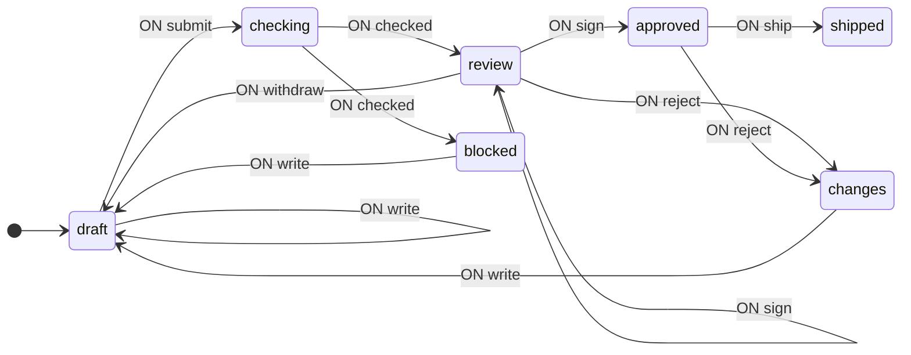
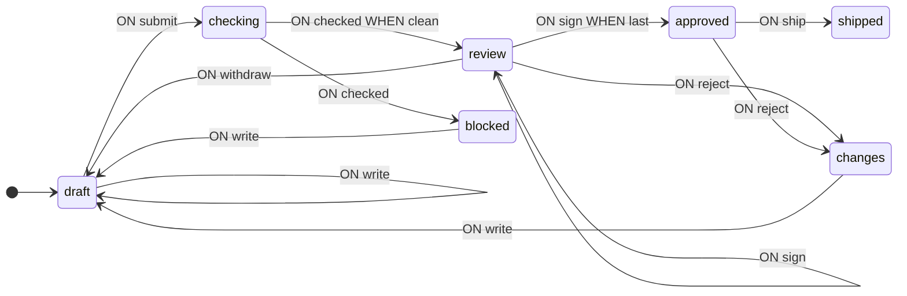
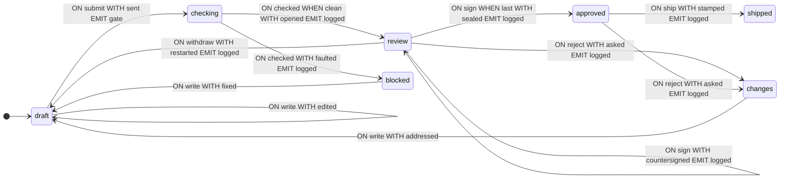

[English](README.md) · **Русский**

# Рецензирование схемы

Полный разбор задачи от постановки до готового автомата: изменение проходит ревью — автоматический гейт, затем две подписи, затем выпуск. Проверяется сама схема конечного автомата, и делают это `validate` и `analyze` из библиотеки. Разделы следуют в порядке работы — сначала граф переходов, затем контекст, условия и операции, затем гейт, страница и анализ. В коде определения типов обычно располагаются перед схемой, но здесь они приводятся по мере необходимости.

Обозначения и определения даны в [руководстве](https://github.com/evgkch/fsmjs/blob/master/README.ru.md). Ссылки вида «п. 4.3» указывают на пункты настоящего документа; на руководство ссылаемся по названию раздела — «README, «Схема переходов»».

**Рабочий проект.** Пример открывается как страница — [живая версия](https://evgkch.github.io/fsmjs/review/). Vite, чистый HTML и TypeScript, без фреймворков; команды выполняются из корня этого репозитория:

```sh
npm install
npm run dev       # http://localhost:5173/review/
npm run build     # tsc --noEmit + сборка в dist/
```

Соответствие файлов разделам документа:

| Файл                               | Разделы                                            |
| ---------------------------------- | -------------------------------------------------- |
| [`src/types.ts`](src/types.ts)     | 2.1, 3 — состояния, события, контекст              |
| [`src/machine.ts`](src/machine.ts) | 4, 5 — условия, операции, схема                    |
| [`src/gate.ts`](src/gate.ts)       | 6 — автоматическая проверка                        |
| [`src/main.ts`](src/main.ts)       | 7 — страница, кнопки, ожидание                     |

**Содержание**

1. [Постановка](#1-постановка)
2. [Граф переходов](#2-граф-переходов)
3. [Контекст](#3-контекст)
4. [Условия](#4-условия)
5. [Операции](#5-операции)
6. [Гейт](#6-гейт)
7. [Обращение из браузера](#7-обращение-из-браузера)
8. [Работа автомата](#8-работа-автомата)
9. [Анализ схемы](#9-анализ-схемы)

## 1. Постановка

Задача: изменение проходит ревью. Сначала его проверяет машина, затем двое подписывают, затем оно уходит в выпуск. На проверку подаётся схема конечного автомата: библиотека проверяет документы, написанные на её языке.

Такой процесс обычно пишут как одну запись и строку статуса: объект `submission` со всеми полями, какие только могут понадобиться, и поле `status`, которое указывает, какие из них сейчас имеют смысл. Такая форма даёт один и тот же баг: документ со статусом `shipped`, но с открытым списком замечаний, или `blocked` с уже стоящей подписью — ничто не мешает ни тому, ни другому, потому что запись хранит все поля, а строка их не отражает.

Исправить это можно, сделав фазу состоянием и дав каждому состоянию ровно те поля, которые у этой фазы есть. Компилятор тогда запрещает то, что процесс раньше допускал по ошибке: поле в состоянии, которому оно не принадлежит, не проходит типизацию.

## 2. Граф переходов

### 2.1 Состояния и события

Таблица 1 — Состояния автомата

| Состояние  | Значение                                              |
| ---------- | ----------------------------------------------------- |
| `draft`    | Черновик: можно править и отправлять                  |
| `checking` | Отправлено на проверку, идёт ожидание                 |
| `blocked`  | Гейт отклонил; идёт исправление                       |
| `review`   | Гейт пропустил; идёт сбор подписей                    |
| `changes`  | Рецензент запросил правки; идёт ответ                 |
| `approved` | Кворум набран; готово к выпуску                       |
| `shipped`  | Выпущено. С ним больше ничего не происходит           |

На входе семь событий: `write` с новым текстом, `submit`, `checked` с ответом гейта, `sign` с именем подписавшего, `reject` с тем, кто и почему, `ship` и `withdraw`. На выходе два: `gate` с текстом для проверки и `logged` с одной строкой для ленты.

```ts
import type { IState, IEvent, Merge } from "@evgkch/fsmjs";

// Чистые состояния без контекста.
type Q = IState<
  "draft" | "checking" | "blocked" | "review" | "changes" | "approved" | "shipped"
>;

type Σ = Merge<
  | IEvent<"write", string>
  | IEvent<"submit">
  | IEvent<"checked", Report>
  | IEvent<"sign", string>
  | IEvent<"reject", { who: string; why: string }>
  | IEvent<"ship">
  | IEvent<"withdraw">
>;

type Λ = Merge<
  IEvent<"gate", { text: string }> | IEvent<"logged", { line: string }>
>;
```

Типы `Ticket`, `Fault`, `Report` и `Sign` будут введены в разделе 3, когда появится контекст.

### 2.2. Первая схема

Исполняемого кода (функций) в ней пока нет — только структура состояний и переходов.

```ts
import type { Schema } from "@evgkch/fsmjs";

const draft = {
  draft: {
    write: [{ to: "draft" }],
    submit: [{ to: "checking" }],
  },
  checking: {
    checked: [{ to: "review" }, { to: "blocked" }],
  },
  blocked: {
    write: [{ to: "draft" }],
  },
  review: {
    sign: [{ to: "approved" }, { to: "review" }, { to: "review" }],
    reject: [{ to: "changes" }],
    withdraw: [{ to: "draft" }],
  },
  changes: {
    write: [{ to: "draft" }],
  },
  approved: {
    ship: [{ to: "shipped" }],
    reject: [{ to: "changes" }],
  },
  shipped: {},
} satisfies Schema<Q, Σ, Λ>;
```

Два правила в паре `checking` + `checked` соответствуют двум ответам гейта — пропустить в `review` или отклонить в `blocked`, — а три правила в паре `review` + `sign` — трём подписям: завершающей кворум, уже данной и любой другой. Чем именно они различаются, пока не записано. `shipped` — конец: правил у него нет.

Схема уже пригодна для выполнения: автомат переходит по состояниям, не производя никаких вычислений.

```ts
import { StateMachine } from "@evgkch/fsmjs";

const walk = new StateMachine<Q, Σ, Λ>(draft, {
  type: "draft",
  context: undefined,
});
walk.dispatch("submit"); // true
walk.state.type; // 'checking'
```

### 2.3. Проверка

```ts
import { validate } from "@evgkch/fsmjs/analysis";
import { formatIssues } from "@evgkch/fsmjs/formatters";

console.log(formatIssues(validate(draft, "draft")));
```

```
⚠ warning node "shipped" has no outgoing transitions
✗ error   cell "checked" at "checking": rule 1 has no guard, so the 1 after it can never fire
⚠ warning cell "sign" at "review" repeats the edge to "review"
✗ error   cell "sign" at "review": rule 1 has no guard, so the 2 after it can never fire
```

Обе ошибки указывают на одно: в списке несколько правил, но нет условий, поэтому всегда срабатывает первое (README, «Схема переходов» и «Ограничения»). Предупреждение о `shipped` чинить не нужно — конечное состояние без выхода для того и существует (README, «validate»). Повторяющееся ребро — та же проблема: два правила в `review` + `sign` ведут в `review`, и без условий они читаются как одно ребро дважды.

```ts
import { toMermaid } from "@evgkch/fsmjs/formatters";

toMermaid(draft, { start: "draft", direction: "LR" });
```



Две стрелки `review --> review` — это два неразличимых правила, нарисованные как одна и та же стрелка дважды.

## 3. Контекст

Условия из п. 2.3 должны различать, вернул ли гейт что-то блокирующее и последняя ли это подпись или повторная. Для этого им нужны ответ гейта и уже данные подписи — то есть контекст.

```ts
/** Что под проверкой: чья-то схема, как её набрали. */
type Doc = { readonly name: string; readonly text: string };

/** Одно замечание к подаче. */
type Fault = {
  readonly rank: "blocker" | "caution";
  readonly where: string;
  readonly what: string;
};

/** Что вернул гейт целиком. */
type Report = {
  readonly faults: readonly Fault[];
  readonly size: { states: number; rules: number; reached: number };
};

/** Подпись: кто и когда. */
type Sign = { readonly who: string; readonly at: number };

/** Что поднимали и на что ответили. */
type Closed = {
  readonly round: number;
  readonly by: string;
  readonly what: string;
};

/** Подача — то, что остаётся в каждой фазе. */
type Ticket = {
  readonly doc: Doc;
  readonly round: number;
  readonly closed: readonly Closed[];
};
```

Подача — не один объект, который обрастает полями по мере движения. В каждом состоянии это другой объект, и состояние определяет, какой: список замечаний есть только там, где что-то заблокировано, список подписей — только там, где кто-то подписал, метка времени — только после выпуска. Состав контекста **разный в разных состояниях**.

Таблица 2 — Что хранит каждое состояние

| Состояние               | Содержание                                                       |
| ----------------------- | ---------------------------------------------------------------- |
| `draft`, `checking`     | заявка — `doc`, `round`, `closed`                                |
| `blocked`               | заявка плюс `faults` — то, на что гейт отклонил                  |
| `review`                | заявка плюс `notes` (предупреждения) и `signs`                   |
| `changes`               | заявка плюс `asked` (запрос) и `by`                              |
| `approved`              | заявка плюс `signs`                                              |
| `shipped`               | заявка плюс `signs` и `at`                                       |

```ts
export type Q = Merge<
  | IState<"draft", Ticket>
  | IState<"checking", Ticket>
  | IState<"blocked", Ticket & { faults: readonly Fault[] }>
  | IState<
      "review",
      Ticket & { notes: readonly Fault[]; signs: readonly Sign[] }
    >
  | IState<"changes", Ticket & { asked: string; by: string }>
  | IState<"approved", Ticket & { signs: readonly Sign[] }>
  | IState<"shipped", Ticket & { signs: readonly Sign[]; at: number }>
>;
```

Постоянная часть — `Ticket`: документ, номер раунда и всё, что по подаче уже улажено. Фаза добавляет только то, что есть у неё одной. Что переносится насквозь, записано один раз — в `Ticket`, — а временное не выходит за пределы фазы, которой принадлежит.

Единая запись со всеми полями сразу выглядела бы короче, но потребовала бы заглушки для каждой фазы без поля — пустой список замечаний, список без подписей, метку времени, которой ещё не было. Это не безобидная условность: именно так документ со статусом `shipped` и оказывается с открытым списком замечаний. Контекст, привязанный к состоянию, эту заглушку исключает: у `draft` нет поля `faults`, в которое её можно было бы положить.

`closed` — то поле, которое процесс из одной записи потерял бы первым. Пункт, который поднимали и на который ответили, *закрывается*, а не удаляется: он хранит раунд, в котором его подняли, и кто это сделал, и остаётся в заявке до конца её жизни. Если правка на самом деле ничего не исправила, следующий раунд поднимет пункт снова, рядом со старым.

У такого контекста есть и следствие: состояние и контекст осмысленны только вместе, поэтому автомат отдаёт их одним значением — `flow.state` типа `FsmState`, — где `type` сужает `context` (README, «Создание автомата и состояние»).

## 4. Условия

### 4.1. Имена в схеме

Условия записываются в правила по именам функций; их реализации приведены в п. 4.2.

> [!NOTE]
> Ниже — набросок, а не схема, которую примет компилятор, и `satisfies` у него нет намеренно. Контекст привязан к состоянию (п. 3): условия читают его, а войти в состояние, которое что-то хранит, без функции контекста нельзя. Одно требует другого, поэтому целиком схема сходится только в п. 5.3, когда появляются операции. Здесь показано лишь то, где в правиле стоят имена условий.

```ts
const guarded = {
  draft: {
    write: [{ to: "draft" }],
    submit: [{ to: "checking" }],
  },
  checking: {
    checked: [{ to: "review", when: clean }, { to: "blocked" }],
  },
  blocked: {
    write: [{ to: "draft" }],
  },
  review: {
    sign: [
      { to: "approved", when: last },
      { to: "review", when: already },
      { to: "review" },
    ],
    reject: [{ to: "changes" }],
    withdraw: [{ to: "draft" }],
  },
  changes: {
    write: [{ to: "draft" }],
  },
  approved: {
    ship: [{ to: "shipped" }],
    reject: [{ to: "changes" }],
  },
  shipped: {},
};
```

Обе ошибки о мёртвых правилах исчезли, а с ними и повторяющееся ребро: условие на втором правиле `sign` отличает его от третьего. Проверка оставляет одно замечание.

```ts
formatIssues(validate(guarded, "draft"));
```

```
⚠ warning node "shipped" has no outgoing transitions
```

Имена условий попадают в диаграмму, потому что берутся у самих функций (README, «Подписи и имена»):



### 4.2. Реализация

```ts
const QUORUM = 2;

/** Нашёл ли гейт что-то блокирующее. Предупреждения — нет: они идут рецензентам. */
function clean(_c: Ticket, report: Report): boolean {
  return !report.faults.some((f) => f.rank === "blocker");
}

/** Та ли это подпись, что добирает кворум. */
function last(c: { signs: readonly Sign[] }, who: string): boolean {
  return !signed(c.signs, who) && c.signs.length + 1 >= QUORUM;
}

function already(c: { signs: readonly Sign[] }, who: string): boolean {
  return signed(c.signs, who);
}

const signed = (signs: readonly Sign[], who: string) =>
  signs.some((s) => s.who === who);
```

`clean` читает ответ гейта: блокер отклоняет, предупреждение пропускает. Условие в автомате задаёт один вопрос — есть ли что-то блокирующее. `last` — проверка кворума: подпись не повторная и доводит счёт до `QUORUM`. `already` отличает второе правило `sign` от третьего. Условия только читают контекст и данные события, не изменяя их (README, «Ограничения»).

## 5. Операции

### 5.1. Контекст после перехода

Таблица 3 — Функции обновления контекста

| Функция         | Что делает                                                          |
| --------------- | ------------------------------------------------------------------- |
| `edited`        | Заменяет текст документа                                            |
| `sent`          | Поднимает раунд по дороге к гейту                                   |
| `fixed`         | Отвечает на блокеры гейта, закрывая их в историю                    |
| `addressed`     | Отвечает на запрос рецензента — тем же способом                     |
| `faulted`       | Переносит замечания гейта в `blocked`                               |
| `opened`        | Вход в `review`: предупреждения — в `notes`, подписей пока нет      |
| `countersigned` | Добавляет подпись, которая не последняя и не повторная              |
| `sealed`        | Добавляет последнюю подпись                                         |
| `asked`         | Поднимает запрос, живущий в `changes`, пока правка его не закроет   |
| `restarted`     | Автор отзывает: снимает добавленное в `review`, заявку сохраняет    |
| `stamped`       | Ставит метку времени выпуска                                        |

В листинге ниже приведены также `text` и хелпер `line`. Контекст они не обновляют, а строят выходные события, поэтому описаны в п. 5.2.

```ts
function edited(c: Ticket, text: string): Ticket {
  return { ...c, doc: { ...c.doc, text } };
}

/** Отправка к гейту — тот раунд, о котором он ответит. */
function sent(c: Ticket): Ticket {
  return { ...c, round: c.round + 1 };
}

/** Автор отзывает из ревью: ничего не поднимали, значит и закрывать нечего. */
function restarted(c: Ticket): Ticket {
  return { doc: c.doc, round: c.round, closed: c.closed };
}

/** Ответ на то, что отклонил гейт: каждый блокер закрывается вместе с правкой. */
function fixed(c: Ticket & { faults: readonly Fault[] }, text: string): Ticket {
  const settled: Closed[] = c.faults
    .filter((f) => f.rank === "blocker")
    .map((f) => ({
      round: c.round,
      by: "gate",
      what: `${f.where} — ${f.what}`,
    }));
  return {
    doc: { ...c.doc, text },
    round: c.round,
    closed: [...c.closed, ...settled],
  };
}

/** Тот же акт, фазой позже: на запрос рецензента ответили, и он остаётся в заявке. */
function addressed(
  c: Ticket & { asked: string; by: string },
  text: string,
): Ticket {
  return {
    doc: { ...c.doc, text },
    round: c.round,
    closed: [...c.closed, { round: c.round, by: c.by, what: c.asked }],
  };
}

function faulted(
  c: Ticket,
  report: Report,
): Ticket & { faults: readonly Fault[] } {
  return { ...c, faults: report.faults };
}

/** Вход в review с тем, что пропустил гейт: предупреждения — человеку на оценку. */
function opened(
  c: Ticket,
  report: Report,
): Ticket & { notes: readonly Fault[]; signs: readonly Sign[] } {
  return {
    ...c,
    notes: report.faults.filter((f) => f.rank === "caution"),
    signs: [],
  };
}

/** Подпись, которая не последняя и не повторная — оба случая отсекли условия выше. */
function countersigned(
  c: Ticket & { notes: readonly Fault[]; signs: readonly Sign[] },
  who: string,
) {
  return { ...c, signs: [...c.signs, { who, at: Date.now() }] };
}

function sealed(
  c: Ticket & { signs: readonly Sign[] },
  who: string,
): Ticket & { signs: readonly Sign[] } {
  return { ...c, signs: [...c.signs, { who, at: Date.now() }] };
}

/** Поднято и не отвечено: остаётся в фазе, пока правка не закроет. */
function asked(
  c: Ticket,
  p: { who: string; why: string },
): Ticket & { asked: string; by: string } {
  return { ...c, asked: p.why, by: p.who };
}

function stamped(c: Ticket & { signs: readonly Sign[] }) {
  return { ...c, at: Date.now() };
}
```

Каждая из этих функций возвращает контекст фазы, в которую происходит *вход*, и каждая переносит заявку насквозь без изменений, если нет причины менять. `...c` — это подача, движущаяся дальше, а записанное рядом — то, что добавляет новая фаза.

`restarted` возвращает только то, что остаётся. Вернуть `c` целиком прошло бы типизацию — контекст `review` *является* `Ticket` с двумя лишними полями — и перенесло бы подписи в `draft`, где тип указывает, что их нет, а страница их не ищет.

`fixed` и `addressed` закрывают, а не выбрасывают. Решила ли правка проблему, показывает следующий `submit`: он снова прогоняет гейт, и всё, что ещё не так, поднимается заново, в следующем раунде, рядом с записью о том, что это поднимали раньше.

Каждая функция возвращает новый объект, а не изменяет переданный (README, «Ограничения»).

### 5.2. Выходные события

Оба выходных события несут данные, поэтому оба `emit` — пары: имя и функция данных (README, «Схема переходов»). Автомат не запускает гейт и не пишет на страницу: он испускает `gate`, когда пришло время проверки, и `logged`, когда что-то произошло, а окружающее приложение это делает.

```ts
function text(c: Ticket) {
  return { text: c.doc.text };
}

const line = (s: string) => ({ line: s });

/* Каждая строка указывает свой раунд, потому что лента — единственное место, где раунды различимы. */

function passed(c: Ticket & { notes: readonly Fault[] }) {
  return line(
    c.notes.length
      ? `round ${c.round}: gate passed with ${c.notes.length} caution(s) — ${QUORUM} sign-offs needed`
      : `round ${c.round}: gate passed clean — ${QUORUM} sign-offs needed`,
  );
}

function refused(c: Ticket & { faults: readonly Fault[] }) {
  const blockers = c.faults.filter((f) => f.rank === "blocker").length;
  return line(`round ${c.round}: gate refused it — ${blockers} blocker(s)`);
}

function oneMore(c: { signs: readonly Sign[] }) {
  return line(`signed off — ${QUORUM - c.signs.length} to go`);
}

function twice(_c: unknown, who: string) {
  return line(`${who} has already signed this one`);
}

function quorum(c: { signs: readonly Sign[] }) {
  return line(`approved by ${c.signs.map((s) => s.who).join(" and ")}`);
}

function sentBack(c: Ticket & { asked: string; by: string }) {
  return line(`round ${c.round}: ${c.by} asked for changes — ${c.asked}`);
}

function pulled() {
  return line("withdrawn by the author");
}

function shipped(c: Ticket) {
  return line(
    `${c.doc.name} shipped after ${c.round} round(s), ${c.closed.length} item(s) settled`,
  );
}
```

Функции данных — это половина `by`: они читают контекст уже *после* перехода и превращают его в данные события. `text` читает документ, в котором автомат теперь находится; `passed` и `refused` — то, что осталось после ответа гейта; `quorum` — подписи, которые только что добили кворум. Страница рисует ленту из этих строк и не ведёт собственного журнала.

### 5.3. Схема целиком

```ts
import { StateMachine } from "@evgkch/fsmjs";

const START: Doc = {
  name: "turnstile.json",
  text: `{
  "locked": {
    "coin": [{ "to": ["open", "reset"], "emit": "opened" }],
    "push": [{ "to": "locked", "emit": "denied" }]
  },
  "open": {
    "push": [{ "to": "locked" }]
  }
}`,
};

export const flow = new StateMachine<Q, Σ, Λ>(
  {
    draft: {
      write: [{ to: ["draft", edited] }],
      submit: [{ to: ["checking", sent], emit: ["gate", text] }],
    },
    checking: {
      checked: [
        { when: clean, to: ["review", opened], emit: ["logged", passed] },
        { to: ["blocked", faulted], emit: ["logged", refused] },
      ],
    },
    blocked: {
      write: [{ to: ["draft", fixed] }],
    },
    review: {
      sign: [
        { when: last, to: ["approved", sealed], emit: ["logged", quorum] },
        { when: already, to: "review", emit: ["logged", twice] },
        { to: ["review", countersigned], emit: ["logged", oneMore] },
      ],
      reject: [{ to: ["changes", asked], emit: ["logged", sentBack] }],
      withdraw: [{ to: ["draft", restarted], emit: ["logged", pulled] }],
    },
    changes: {
      write: [{ to: ["draft", addressed] }],
    },
    approved: {
      ship: [{ to: ["shipped", stamped], emit: ["logged", shipped] }],
      reject: [{ to: ["changes", asked], emit: ["logged", sentBack] }],
    },
    shipped: {},
  },
  { type: "draft", context: { doc: START, round: 0, closed: [] } },
);
```

Второе правило `sign` — единственное во всей схеме, чья цель записана простым именем: `to: "review"`. Это холостой ход — повторная подпись ничего не меняет, поэтому переход возвращает в `review` с прежним контекстом. Переходу `review` → `review` операция не нужна: контекст, который он несёт, уже тот, которого хочет цель (README, «Схема переходов»).

Начальное состояние — `draft`, оно несёт `Ticket`, а `doc` в этом тикете — сама схема, `START`, турникет, записанный на языке библиотеки.

## 6. Гейт

Гейт — то, что CI прогнал бы до того, как на документ посмотрит человек. Проверяется схема, поэтому и проверки здесь из самой библиотеки: `validate` ищет замечания, `analyze` — форму.

```ts
import { analyze, validate } from "@evgkch/fsmjs/analysis";
import { edges, nodes } from "@evgkch/fsmjs";
import type { Fault, Report } from "./types.js";

/** Схема в том виде, в каком её отдаёт текстовое поле: ключи — состояния, значения — что угодно. */
type Schema = Record<string, unknown>;
```

`Schema` намеренно неплотный: каждый читатель ниже написан для графа, который может быть бессмыслицей, — это и есть валидатор, — и каждый возвращает значение, а не бросает исключение. Написать `object` значило бы потерять имена состояний: `keyof object` — это `never`, и `nodes` вернул бы нечего проверять.

### 6.1. Что возвращает библиотека

```ts
const found = (graph: Schema, start: string): Fault[] =>
  validate(graph, start).map((issue) => ({
    rank: issue.severity === "error" ? "blocker" : "caution",
    where: issue.event ? `${issue.node} · ${issue.event}` : issue.node,
    what: issue.message,
  }));
```

Две степени строгости `validate` сохраняются как есть: ошибка блокирует, предупреждение — то, что рецензенты должны увидеть и могут принять. Перевод в `Fault` происходит здесь, поэтому условие в автомате задаёт один вопрос — есть ли что-то блокирующее.

### 6.2. Домашние правила

```ts
const policy = (graph: Schema, start: string): Fault[] => {
  const out: Fault[] = [];
  const facts = analyze(graph, start);

  if (facts.terminal.length === facts.nodes.length)
    out.push({
      rank: "blocker",
      where: "schema",
      what: "every state is a dead end — nothing here can run",
    });

  for (const q of nodes(graph))
    if (q !== q.toLowerCase())
      out.push({
        rank: "caution",
        where: q,
        what: "state names are lower case in this codebase",
      });

  for (const row of edges(graph))
    if (row.when === "?")
      out.push({
        rank: "caution",
        where: `${row.from} · ${row.on}`,
        what: "the guard has no name, so no diagram can say what it decides",
      });

  return out;
};
```

Домашние правила — этой организации, а не библиотеки. Их три: схема, из которой никто не может выйти; имя состояния, которое будет плохо читаться в каждой диаграмме; и правило, условию которого никто не дал имя. Третье читает сериализованную форму: выгрузка сохраняет на месте функции *имя* операции, а безымянное условие возвращается как `?` в колонке `when` — его и ловит это правило.

Два списка разделены: `found` — факты о схеме, `policy` — политика.

### 6.3. Прогон гейта

```ts
/** Схема, которая не разбирается, — это одно замечание и никакого отчёта: анализировать нечего. */
const unreadable = (what: string): Report => ({
  faults: [{ rank: "blocker", where: "document", what }],
  size: { states: 0, rules: 0, reached: 0 },
});

export function gate(text: string): Report {
  let read: unknown;
  try {
    read = JSON.parse(text);
  } catch (e) {
    return unreadable((e as Error).message);
  }
  if (read === null || typeof read !== "object" || Array.isArray(read))
    return unreadable("a schema is an object keyed by state");

  const graph = read as Schema;
  const start = Object.keys(graph)[0];
  if (start === undefined) return unreadable("the schema names no states");

  const facts = analyze(graph, start);
  return {
    faults: [...found(graph, start), ...policy(graph, start)],
    size: {
      states: facts.nodes.length,
      rules: edges(graph).length,
      reached: facts.reachable.length,
    },
  };
}
```

Гейт принимает текст, а не схему: автор отправляет документ, и «это не валидный JSON» — первое, что пайплайн обязан уметь выдать. Стартовое состояние — первое из названных в схеме: то же соглашение, которым пользуются читатели библиотеки.

## 7. Обращение из браузера

### 7.1. Разметка и отправка

Страница — очередь из одной подачи: текстовое поле для документа, строка меток фаз, открытые замечания, улаженные пункты, счётчик подписей и кнопки, которые двигают её дальше.

```ts
const BOARD = ["dana", "ravi"] as const;

const el = <T extends HTMLElement>(id: string) =>
  document.getElementById(id) as T;

const doc = el<HTMLTextAreaElement>("doc");
const why = el<HTMLInputElement>("why");
// … остальные ссылки на элементы …

doc.addEventListener("input", () => flow.dispatch("write", doc.value));
submit.addEventListener("click", () => flow.dispatch("submit"));
ship.addEventListener("click", () => flow.dispatch("ship"));
withdraw.addEventListener("click", () => flow.dispatch("withdraw"));
reject.addEventListener("click", () =>
  flow.dispatch("reject", {
    who: "dana",
    why: why.value.trim() || "no reason given",
  }),
);
for (const [who, button] of signs)
  button.addEventListener("click", () => flow.dispatch("sign", who));
```

Ни один обработчик не проверяет состояние. Каждый ввод уходит напрямую в `dispatch`, а примет ли его схема — дело схемы. Нажатие клавиши, пришедшее, пока документ у гейта, отклоняет таблица: правила `write` в `checking` нет, поэтому `dispatch` возвращает `false`, и состояние не меняется (README, «Выполнение перехода: `dispatch` и `can`»).

### 7.2. Ожидание: гейт как слушатель

```ts
flow.rx.on("gate", ({ text }) => {
  setTimeout(() => flow.dispatch("checked", gate(text)), 700);
});

flow.rx.on("logged", ({ line }) => {
  const row = document.createElement("li");
  row.textContent = line;
  feed.prepend(row);
});
```

Единственный побочный эффект пайплайна отложен дважды. Один раз потому, что обязан: этот слушатель срабатывает *внутри* перехода, который испустил `gate`, а библиотека отказывает в отправке изнутри — переход внутри перехода позволил бы внутренней фиксации быть затёртой внешней, поэтому она бросает исключение, а не портит прогон (README, «Атомарность и вложенные вызовы»). Второй раз потому, что CI занимает мгновение, а фаза, которая начинается и кончается в одном тике, — фаза, которой никто не видит; задержка делает ожидание видимым как фазу.

Ждёт автомат. `submit` испускает `gate`, этот код прогоняет проверки и отправляет `checked` обратно, а между ними автомат находится в `checking` — состоянии без правила `write`, что и делает документ недоступным для правки, пока он у CI. Слушатель не хранит ни промиса, ни флага, ни `busy`.

### 7.3. Отрисовка

```ts
/** Строка из двух линий: о чём речь и что сказано. */
const item = (cls: string, where: string, what: string) => {
  const row = document.createElement("li");
  row.className = cls;
  const a = document.createElement("span");
  a.className = "where";
  a.textContent = where;
  const b = document.createElement("span");
  b.className = "what";
  b.textContent = what;
  row.append(a, b);
  return row;
};

const fault = (f: Fault) => item(f.rank, f.where, f.what);

/** Пункт, который поднимали и на который ответили, — сохранён и помечен раундом. */
const closed = (c: Closed) =>
  item("done", `round ${c.round} · ${c.by}`, c.what);

function paint(): void {
  const s = flow.state;
  document.body.dataset["phase"] = s.type;
  phaseOut.textContent = s.type;

  // Правка, не дошедшая до правила `write`, — набранная, пока документ у гейта, — не должна выжить.
  if (doc.value !== s.context.doc.text) doc.value = s.context.doc.text;

  faultsOut.replaceChildren(
    ...(s.type === "blocked"
      ? s.context.faults.map(fault)
      : s.type === "review"
        ? s.context.notes.map(fault)
        : s.type === "changes"
          ? [item("caution", s.context.by, s.context.asked)]
          : []),
  );

  closedOut.replaceChildren(...s.context.closed.map(closed));
  settledBox.hidden = s.context.closed.length === 0;

  // … счётчик подписей и счётчик раунда …

  submit.disabled = !flow.can("submit");
  ship.disabled = !flow.can("ship");
  withdraw.disabled = !flow.can("withdraw");
  reject.disabled = !flow.can("reject", { who: "dana", why: "" });
  for (const [who, button] of signs) button.disabled = !flow.can("sign", who);
}

flow.rx.on(TRANSITION, paint);
paint();
```

`paint` срабатывает после каждого перехода и читает автомат — и ничего больше. Состояние — размеченное объединение, поэтому `s.type` сужает `s.context`: внутри ветки `review` подписи в области видимости, а список замечаний — нет, потому что у документа в ревью нет списка замечаний. Компилятор следит за тем же, за чем и схема.

Кнопка включена, когда на вопрос `can(event)` — тот же вопрос, который проверяет следующий `dispatch`, — автомат возвращает «да»; поэтому множество того, что сейчас можно, хранит схема, а не эта страница. Удалите правило из таблицы — кнопка погаснет; добавьте — загорится.

## 8. Работа автомата

Прогон выполняется отправкой событий напрямую, без страницы; разметка и подписки из п. 7 в нём не задействованы. После каждого события показаны состояние, раунд и то в контексте, что важно.

```
write "…" (сломанный JSON)   draft     раунд 0
submit                       checking  раунд 1
checked · 1 блокер           blocked   раунд 1   замечаний: 1
write "…" (исправлено)       draft     раунд 1   закрыто: 1
submit                       checking  раунд 2
checked · чисто              review    раунд 2   подписей: —
sign "dana"                  review    раунд 2   подписи: dana
sign "ravi"                  approved  раунд 2   подписи: dana, ravi
ship                         shipped   раунд 2   at: установлено
```

`submit` — единственное событие, которое сдвигает раунд; ответ гейта возвращается событием `checked`, и между ними — целое состояние. Первый раунд отклонили: документ был сломанным JSON, гейт вернул один блокер, и автомат перешёл в `blocked`, перенеся его с собой. Правка вернула документ в `draft`, а `fixed` по дороге закрыл блокер в историю: `closed` выросло до единицы, и пункт в нём не исчез — на него ответили. Второй раунд прошёл чисто; `sign "dana"` добавил первую подпись, а `sign "ravi"` сработал по условию `last` и перевёл автомат в `approved`. `ship` поставил метку времени и перевёл его в `shipped`, где правил нет вовсе.

Непоказанный путь: `reject` в `review` ведёт в `changes`, перенося запрос; правка закрывает его через `addressed`, который закрывает запрос так же, как `fixed` закрыл блокер. `withdraw` в `review` возвращает в `draft` через `restarted`, который снимает подписи — поле, которого у черновика нет.

## 9. Анализ схемы

### 9.1. Диаграмма

Та же схема, что и в пп. 2.3 и 4.1, но теперь с операциями и выходными событиями.

```ts
toMermaid(flow.schema, { start: "draft", direction: "LR" });
```



Все операции здесь — именованные функции, поэтому `?` в подписях не встречается. У холостого хода `review --> review` подписи `WITH` нет — он переносит контекст без изменений, и называть нечего. Подписи `EMIT` называют событие и никогда — функцию данных: `by` — единственное слово, которое диаграмма опускает (README, «Подписи и имена»).

### 9.2. Проверка

```ts
formatIssues(validate(flow.schema, "draft"));
```

```
⚠ warning node "shipped" has no outgoing transitions
```

Недостижимых состояний нет, мёртвых правил нет, и у каждого состояния, кроме одного, есть выход. Исключение — `shipped`, и оно исключение намеренное: предупреждение — способ библиотеки отметить конечное состояние, а не то, что надо чинить (README, «validate»).
