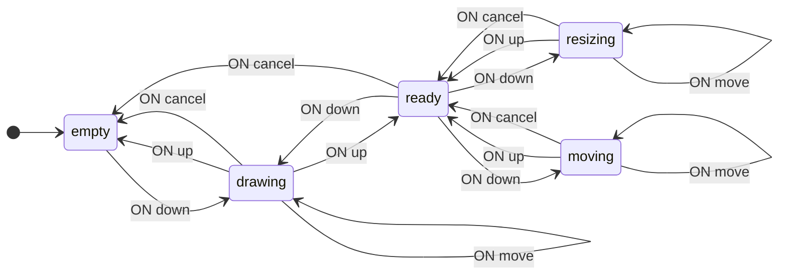
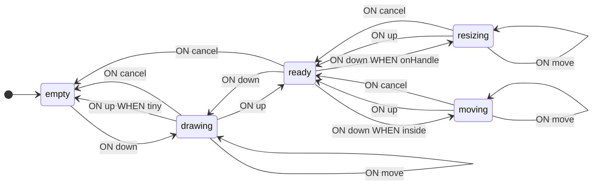
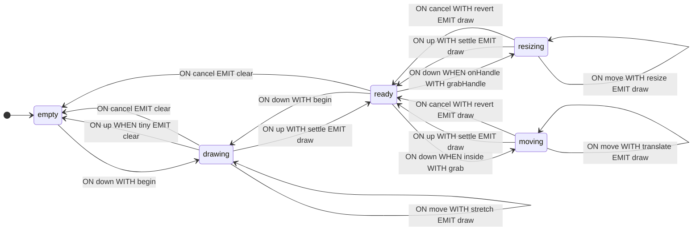

[English](README.md) · **Русский**

# Прямоугольник выделения

Полный разбор задачи от постановки до готового автомата: управление прямоугольником выделения в браузере. Разделы следуют в порядке работы — сначала граф переходов, затем контекст, условия и операции, затем интеграция с программой и анализ. В коде определения типов обычно располагаются перед схемой, но здесь они приводятся по мере необходимости.

Обозначения и определения даны в [руководстве](https://github.com/evgkch/fsmjs/blob/master/README.ru.md). Ссылки вида «п. 4.3» указывают на пункты настоящего документа; на руководство ссылаемся по названию раздела — «README, «Схема переходов»».

**Рабочий проект.** Пример открывается как страница — [живая версия](https://evgkch.github.io/fsmjs/selection-rect/). Vite, чистый HTML и TypeScript, без фреймворков; команды выполняются из корня этого репозитория:

```sh
npm install
npm run dev       # http://localhost:5173/selection-rect/
npm run build     # tsc --noEmit + сборка в dist/
```

Соответствие файлов разделам документа:

| Файл                                 | Разделы                                       |
| ------------------------------------ | --------------------------------------------- |
| [`src/types.ts`](src/types.ts)       | 2.1, 3 — состояния, события, контекст         |
| [`src/geometry.ts`](src/geometry.ts) | 4.2 — `norm`, `handleAt`                      |
| [`src/machine.ts`](src/machine.ts)   | 4.1, 4.2, 5 — условия, операции, схема        |
| [`src/main.ts`](src/main.ts)         | 6, 9 — разметка, курсор, отмена               |

**Содержание**

1. [Постановка](#1-постановка)
2. [Граф переходов](#2-граф-переходов)
3. [Контекст](#3-контекст)
4. [Условия](#4-условия)
5. [Операции](#5-операции)
6. [Обращение из браузера](#6-обращение-из-браузера)
7. [Работа автомата](#7-работа-автомата)
8. [Анализ схемы](#8-анализ-схемы)
9. [Отмена перетаскивания](#9-отмена-перетаскивания)

## 1. Постановка

Задача: рисовать прямоугольник выделения на экране и управлять им — перемещать и менять размер за углы и рёбра. Клавиша Escape отменяет текущее действие, щелчок по пустому месту снимает выделение.

Одно и то же перемещение указателя может означать разные действия: растягивание нового прямоугольника, перенос существующего или изменение размера. Конкретное действие зависит от того, что происходило до нажатия и в какую часть прямоугольника попал указатель.

## 2. Граф переходов

### 2.1 Состояния и события

Таблица 1 — Состояния автомата

| Состояние  | Значение                                     |
| ---------- | -------------------------------------------- |
| `empty`    | Выделения нет                                |
| `ready`    | Прямоугольник задан, действие не выполняется |
| `drawing`  | Идёт протяжка нового прямоугольника          |
| `moving`   | Идёт перенос                                 |
| `resizing` | Идёт изменение размера                       |

На входе четыре события: `down`, `move`, `up` и `cancel`. Первые два несут координату указателя вместе с размером области, в которой он находится. На выходе два: `draw` с прямоугольником и `clear` без данных.

```ts
import type { IState, IEvent, Merge } from "@evgkch/fsmjs";

// Чистые состояния без контекста.
type Q = IState<"empty" | "ready" | "drawing" | "moving" | "resizing">;

type Σ = Merge<
  IEvent<"down" | "move", Spot> | IEvent<"up"> | IEvent<"cancel">
>;
type Λ = Merge<IEvent<"draw", { rect: Rect }> | IEvent<"clear">>;
```

Типы `Point`, `Rect`, `Size` и `Spot` будут введены в разделе 3, когда появится контекст и геометрия.

### 2.2. Первая схема

Исполняемого кода (функций) в ней пока нет — только структура состояний и переходов.

```ts
import type { Schema } from "@evgkch/fsmjs";

const draft = {
  empty: { down: [{ to: "drawing" }] },
  ready: {
    down: [{ to: "resizing" }, { to: "moving" }, { to: "drawing" }],
    cancel: [{ to: "empty" }],
  },
  drawing: {
    move: [{ to: "drawing" }],
    up: [{ to: "empty" }, { to: "ready" }],
    cancel: [{ to: "empty" }],
  },
  moving: {
    move: [{ to: "moving" }],
    up: [{ to: "ready" }],
    cancel: [{ to: "ready" }],
  },
  resizing: {
    move: [{ to: "resizing" }],
    up: [{ to: "ready" }],
    cancel: [{ to: "ready" }],
  },
} satisfies Schema<Q, Σ, Λ>;
```

Три правила в паре `ready` + `down` соответствуют трём разным местам нажатия, а два правила в паре `drawing` + `up` — прямоугольнику меньше допустимого размера и всем остальным случаям. Чем именно они различаются, пока не записано.

Схема уже пригодна для выполнения: автомат переходит по состояниям, не производя никаких вычислений.

```ts
import { StateMachine } from "@evgkch/fsmjs";

const walk = new StateMachine<Q, Σ, Λ>(draft, {
  type: "empty",
  context: undefined,
});
walk.dispatch("down", { x: 0, y: 0, area: { w: 400, h: 300 } }); // true
walk.state.type; // 'drawing'
```

### 2.3. Проверка

```ts
import { validate } from "@evgkch/fsmjs/analysis";
import { formatIssues } from "@evgkch/fsmjs/formatters";

console.log(formatIssues(validate(draft, "empty")));
```

```
✗ error   cell "down" at "ready": rule 1 has no guard, so the 2 after it can never fire
✗ error   cell "up" at "drawing": rule 1 has no guard, so the 1 after it can never fire
```

Оба замечания указывают на одну и ту же проблему: в списке несколько правил, но нет условий, поэтому всегда срабатывает первое (README, «Схема переходов» и «Ограничения»).

```ts
import { toMermaid } from "@evgkch/fsmjs/formatters";

toMermaid(draft, { start: "empty", direction: "LR" });
```



## 3. Контекст

Условия из п. 2.3 должны различать нажатие на ручку и нажатие в середину, а значит — иметь доступ к самому прямоугольнику. Для этого нам понадобятся геометрические типы.

```ts
type Point = { x: number; y: number };
type Rect = { x0: number; y0: number; x1: number; y1: number };
type Size = { w: number; h: number };
type Spot = Point & { area: Size };
```

Перенос отсчитывается от точки начала протяжки, а отмена возвращает прямоугольник к виду на момент её начала. Но состав контекста **разный в разных состояниях**.

Таблица 2 — Что помнит каждое состояние

| Состояние               | Содержание                                                    |
| ----------------------- | ------------------------------------------------------------- |
| `empty`                 | ничего                                                        |
| `ready`                 | `rect` — прямоугольник                                        |
| `drawing`, `moving`     | `rect`, `from` (точка начала протяжки), `start` (прямоугольник на её начало) |
| `resizing`              | то же плюс `handle` — захваченная ручка                       |

```ts
type Handle = "n" | "s" | "e" | "w" | "nw" | "ne" | "sw" | "se";

/** Что помнит любая протяжка. */
type Dragging = { rect: Rect; from: Point; start: Rect };

type Sel = Merge<
  | IState<"empty">
  | IState<"ready", { rect: Rect }>
  | IState<"drawing" | "moving", Dragging>
  | IState<"resizing", Dragging & { handle: Handle }>
>;
```

Единый контекст со всеми полями сразу выглядел бы короче, но потребовал бы начального значения для `empty` — а его нет: в пустом состоянии нет ни прямоугольника, ни точки захвата, ни ручки. Пришлось бы сочинить `blank` с нулевым прямоугольником вместо отсутствующего, и это не безобидная условность: такой прямоугольник 0×0 однажды доехал до экрана после отмены и потребовал заплатки. Контекст, привязанный к состоянию, эту заглушку исключает: у `empty` нет поля, в которое её можно было бы положить.

У такого контекста есть и следствие: состояние и контекст осмысленны только вместе, поэтому автомат отдаёт их одним значением — `sel.state` типа `FsmState`, — где `type` сужает `context` (README, «Создание автомата и состояние»).

## 4. Условия

### 4.1. Имена в схеме

Условия записываются в правила по именам функций; их реализации приведены в п. 4.2.

> [!NOTE]
> Ниже — набросок, а не схема, которую примет компилятор, и `satisfies` у него нет намеренно. Контекст привязан к состоянию (п. 3): условия читают его, а войти в состояние, которое что-то хранит, без функции контекста нельзя. Одно требует другого, поэтому целиком схема сходится только в п. 5.3, когда появляются операции. Здесь показано лишь то, где в правиле стоят имена условий.

```ts
const guarded = {
  empty: { down: [{ to: "drawing" }] },
  ready: {
    down: [
      { to: "resizing", when: onHandle },
      { to: "moving", when: inside },
      { to: "drawing" },
    ],
    cancel: [{ to: "empty" }],
  },
  drawing: {
    move: [{ to: "drawing" }],
    up: [{ to: "empty", when: tiny }, { to: "ready" }],
    cancel: [{ to: "empty" }],
  },
  moving: {
    move: [{ to: "moving" }],
    up: [{ to: "ready" }],
    cancel: [{ to: "ready" }],
  },
  resizing: {
    move: [{ to: "resizing" }],
    up: [{ to: "ready" }],
    cancel: [{ to: "ready" }],
  },
};
```

Проверка больше не выдаёт замечаний: в обоих списках безусловное правило стоит последним, так что мёртвых правил нет.

```ts
validate(guarded, "empty"); // []
```

Имена условий попадают в диаграмму, потому что берутся у самих функций (README, «Подписи и имена»):



### 4.2. Реализация

`norm` приводит прямоугольник к виду, где `x0 ≤ x1` и `y0 ≤ y1`. `handleAt` возвращает захваченную ручку либо `undefined`: имя складывается из вертикальной и горизонтальной половин, поэтому угол получается без перечисления восьми случаев.

```ts
const TOL = 6;

function norm(r: Rect): Rect {
  return {
    x0: Math.min(r.x0, r.x1),
    y0: Math.min(r.y0, r.y1),
    x1: Math.max(r.x0, r.x1),
    y1: Math.max(r.y0, r.y1),
  };
}

function handleAt(r: Rect, p: Point): Handle | undefined {
  const { x0, y0, x1, y1 } = norm(r);
  function near(a: number, b: number) {
    return Math.abs(a - b) <= TOL;
  }
  function span(v: number, a: number, b: number) {
    return v >= a - TOL && v <= b + TOL;
  }
  const v = near(p.y, y0) ? "n" : near(p.y, y1) ? "s" : "";
  const h = near(p.x, x0) ? "w" : near(p.x, x1) ? "e" : "";
  if (!v && !h) return;
  if (!span(p.x, x0, x1) || !span(p.y, y0, y1)) return;
  return (v + h) as Handle;
}

function onHandle(s: { rect: Rect }, p: Point) {
  return handleAt(s.rect, p) !== undefined;
}

function inside(s: { rect: Rect }, p: Point) {
  const { x0, y0, x1, y1 } = norm(s.rect);
  return p.x > x0 && p.x < x1 && p.y > y0 && p.y < y1;
}

function tiny(s: Dragging) {
  const r = norm(s.rect);
  return r.x1 - r.x0 < TOL || r.y1 - r.y0 < TOL;
}
```

Условия только читают контекст и данные события, не изменяя их (README, «Ограничения»).

## 5. Операции

### 5.1. Контекст после перехода

Таблица 3 — Функции обновления контекста

| Функция      | Что делает                                              |
| ------------ | -------------------------------------------------------- |
| `begin`      | Начинает новый прямоугольник в точке указателя           |
| `grab`       | Запоминает точку и прямоугольник на начало протяжки      |
| `grabHandle` | То же плюс захваченная ручка                             |
| `stretch`    | Сдвигает свободный угол                                  |
| `translate`  | Переносит на смещение указателя                          |
| `resize`     | Сдвигает стороны, названные ручкой                       |
| `settle`     | Выход в `ready`: оставить прямоугольник, остальное снять |
| `revert`     | Возвращает прямоугольник, запомненный при захвате        |

В листинге ниже приведена также функция `shot`. Контекст она не обновляет, а строит данные выходного события, поэтому описана в п. 5.2.

```ts
function begin(_s: unknown, p: Spot): Dragging {
  const q = within(p, p.area);
  const r = { x0: q.x, y0: q.y, x1: q.x, y1: q.y };
  return { rect: r, from: q, start: r };
}

function grab(s: { rect: Rect }, p: Spot): Dragging {
  return { rect: s.rect, from: { x: p.x, y: p.y }, start: s.rect };
}

function grabHandle(s: { rect: Rect }, p: Spot): Dragging & { handle: Handle } {
  return { ...grab(s, p), handle: handleAt(s.rect, p) ?? "se" };
}

function stretch(s: Dragging, p: Spot): Dragging {
  const q = within(p, p.area);
  return { ...s, rect: { ...s.start, x1: q.x, y1: q.y } };
}

function translate(s: Dragging, p: Spot): Dragging {
  const dx = p.x - s.from.x,
    dy = p.y - s.from.y;
  return {
    ...s,
    rect: slideInto(
      {
        x0: s.start.x0 + dx,
        y0: s.start.y0 + dy,
        x1: s.start.x1 + dx,
        y1: s.start.y1 + dy,
      },
      p.area,
    ),
  };
}

function resize(s: Dragging & { handle: Handle }, p: Spot) {
  const g = s.handle,
    b = norm(s.start),
    q = within(p, p.area);
  return {
    ...s,
    rect: {
      x0: g.includes("w") ? q.x : b.x0,
      y0: g.includes("n") ? q.y : b.y0,
      x1: g.includes("e") ? q.x : b.x1,
      y1: g.includes("s") ? q.y : b.y1,
    },
  };
}

/** Выход из протяжки в `ready`: оставить прямоугольник, всё, что нужно только для протяжки, отбросить. */
function settle(s: Dragging): { rect: Rect } {
  return { rect: s.rect };
}

/** `cancel` во время протяжки: вернуть прямоугольник, каким он был на момент её начала. */
function revert(s: Dragging): { rect: Rect } {
  return { rect: s.start };
}

/** Полезная нагрузка для `draw` — строится из контекста *после* перемещения. */
function shot(s: { rect: Rect }) {
  return { rect: norm(s.rect) };
}
```

Выделение не покидает холст, и обеспечивают это операции обновления контекста, а не код отрисовки. Контекст читает вся остальная программа, поэтому ограничение «прямоугольник внутри области» относится к самому автомату, а не к способу его показать.

```ts
/** Точка, втянутая обратно в область, — край останавливается на границе. */
function within(p: Point, a: Size): Point {
  return {
    x: Math.min(Math.max(p.x, 0), a.w),
    y: Math.min(Math.max(p.y, 0), a.h),
  };
}

/** Прямоугольник, сдвинутый внутрь с сохранением размера, — он прижимается к границе. */
function slideInto(r: Rect, a: Size): Rect {
  const n = norm(r);
  const dx = n.x0 < 0 ? -n.x0 : n.x1 > a.w ? a.w - n.x1 : 0;
  const dy = n.y0 < 0 ? -n.y0 : n.y1 > a.h ? a.h - n.y1 : 0;
  return dx === 0 && dy === 0
    ? r
    : { x0: r.x0 + dx, y0: r.y0 + dy, x1: r.x1 + dx, y1: r.y1 + dy };
}
```

Ограничить одну лишь точку указателя было бы недостаточно, и нагляднее всего это в `translate`: если взять прямоугольник за середину и потянуть, указатель всё время остаётся внутри холста, а дальний угол из него выходит. Перемещаемый прямоугольник должен сохранить размер и упереться в границу, то есть ограничение накладывается на прямоугольник целиком, а не на одну его точку.

Каждая функция возвращает новый объект, а не изменяет переданный (README, «Ограничения»).

### 5.2. Выходные события

Событие `draw` содержит прямоугольник, поэтому его `emit` — пара: имя и функция данных (README, «Схема переходов»). Событие `clear` не содержит данных, и его `emit` — простое имя.

Данные для `draw` строит функция `shot` из листинга п. 5.1. Это единственная функция примера, которая читает контекст уже после перехода.

### 5.3. Схема целиком

```ts
import { StateMachine } from "@evgkch/fsmjs";

const sel = new StateMachine<Sel, Σ, Λ>(
  {
    empty: { down: [{ to: ["drawing", begin] }] },
    ready: {
      down: [
        { to: ["resizing", grabHandle], when: onHandle },
        { to: ["moving", grab], when: inside },
        { to: ["drawing", begin] },
      ],
      cancel: [{ to: "empty", emit: "clear" }],
    },
    drawing: {
      move: [{ to: ["drawing", stretch], emit: ["draw", shot] }],
      up: [
        { to: "empty", when: tiny, emit: "clear" },
        { to: ["ready", settle], emit: ["draw", shot] },
      ],
      cancel: [{ to: "empty", emit: "clear" }],
    },
    moving: {
      move: [{ to: ["moving", translate], emit: ["draw", shot] }],
      up: [{ to: ["ready", settle], emit: ["draw", shot] }],
      cancel: [{ to: ["ready", revert], emit: ["draw", shot] }],
    },
    resizing: {
      move: [{ to: ["resizing", resize], emit: ["draw", shot] }],
      up: [{ to: ["ready", settle], emit: ["draw", shot] }],
      cancel: [{ to: ["ready", revert], emit: ["draw", shot] }],
    },
  },
  { type: "empty", context: undefined },
);
```

## 6. Обращение из браузера

### 6.1. Разметка и подписки

```html
<div
  id="area"
  style="position:relative; width:400px; height:300px; border:1px solid #ccc"
>
  <div
    id="box"
    style="position:absolute; display:none;
                       border:1px solid #4f46e5; background:#4f46e522"
  ></div>
</div>
```

Координаты округляются здесь, на входе, а не при выводе: `clientX` и ограничивающий прямоугольник дробные при зуме страницы или на HiDPI-экране, а всё дальнейшее — контекст, допуск условий, CSS рамки, печатаемые числа — выводится из этой одной точки. Округлив один раз на входе, получаем согласованность всех вычислений.

```ts
const area = document.getElementById("area")!;
const box = document.getElementById("box")!;

function at(e: PointerEvent): Spot {
  const b = area.getBoundingClientRect();
  return {
    x: Math.round(e.clientX - b.left),
    y: Math.round(e.clientY - b.top),
    area: { w: Math.round(b.width), h: Math.round(b.height) },
  };
}

area.addEventListener("pointerdown", (e) => {
  area.setPointerCapture(e.pointerId);
  sel.dispatch("down", at(e));
});
area.addEventListener("pointermove", (e) => sel.dispatch("move", at(e)));
area.addEventListener("pointerup", () => sel.dispatch("up"));
// Указатель, отобранный браузером, события `up` не пришлёт. `cancel` уже есть в
// алфавите, и его принимает каждое состояние перетаскивания, так что этот случай покрывается
// одной строкой.
area.addEventListener("pointercancel", () => sel.dispatch("cancel"));
addEventListener("keydown", (e) => {
  if (e.key === "Escape") sel.dispatch("cancel");
});

sel.rx.on("draw", ({ rect }) =>
  Object.assign(box.style, {
    display: "block",
    left: `${rect.x0}px`,
    top: `${rect.y0}px`,
    width: `${rect.x1 - rect.x0}px`,
    height: `${rect.y1 - rect.y0}px`,
  }),
);
sel.rx.on("clear", () => {
  box.style.display = "none";
});
```

Проверок текущего состояния в обработчиках нет. Событие `pointermove` всегда отправляет `move`, но в состоянии `ready` такой переход схемой не предусмотрен, и `dispatch` возвращает `false`, не изменяя состояния (README, «Выполнение перехода: `dispatch` и `can`»).

### 6.2. Курсор

Курсор подсказывает, какое действие будет выполнено при нажатии. Ответ на этот же вопрос заложен в условиях схемы, поэтому представление использует те же функции `handleAt` и `inside`. Но сначала оно обязано назвать состояние: в `empty` прямоугольника нет, а `type` — тот дискриминант, проверка которого открывает доступ к полям контекста.

```ts
function cursor(at: { context: { rect: Rect } }, p: Point) {
  const g = handleAt(at.context.rect, p);
  return g ? `${g}-resize` : inside(at.context, p) ? "move" : "crosshair";
}

area.addEventListener("pointermove", (e) => {
  const p = at(e);
  sel.dispatch("move", p);
  const now = sel.state;
  if (now.type === "ready") area.style.cursor = cursor(now, p);
});
```

Для прямоугольника 20,20 — 120,80 в состоянии `ready`:

```
  (20,20)      nw-resize
  (70,80)      s-resize
  (120,50)     e-resize
  (70,50)      move
  (300,300)    crosshair
```

Имена ручек совпадают с именами курсоров CSS: тип `Handle` использует обозначения сторон света, и соответствующее CSS-свойство формируется простой подстановкой.

## 7. Работа автомата

Прогон выполняется отправкой координат напрямую, без использования браузера; разметка и подписки из п. 6.1 в нём не задействованы. После каждого события показаны состояние и прямоугольник.

```
down 20,20  (пусто)          drawing   20,20 0×0
move 120,80                  drawing   20,20 100×60
up                           ready     20,20 100×60
down 70,50  (внутри)         moving    20,20 100×60
move 90,70                   moving    40,40 100×60
up                           ready     40,40 100×60
down 140,100 (угол se)       resizing  40,40 100×60
move 200,160                 resizing  40,40 160×120
cancel                       ready     40,40 100×60
down 40,70  (ребро w)        resizing  40,40 100×60
move 10,70                   resizing  10,40 130×60
up                           ready     10,40 130×60
down 300,300 (снаружи)       drawing   300,300 0×0
up  (без движения)           empty     —
```

Событие `cancel` посреди изменения размера вернуло прямоугольник к виду на момент захвата: его хранит поле `start`. Захват за ребро `w` сдвинул только левую сторону, потому что `resize` меняет координаты, названные ручкой. Событие `up` без движения дало прямоугольник нулевого размера, условие `tiny` его отбросило, и выделение снялось.

## 8. Анализ схемы

### 8.1. Диаграмма

Та же схема, что и в пп. 2.3 и 4.1, но теперь с операциями и выходными событиями.

```ts
toMermaid(sel.schema, { start: "empty", direction: "LR" });
```



Все операции здесь — именованные функции, поэтому `?` в подписях не встречается: форматтер берёт имя у самой функции (README, «Подписи и имена»). Рёбра из `empty` подписи `WITH` не имеют вовсе — это состояние ничего не хранит, и строить нечего.

### 8.2. Проверка

```ts
validate(sel.schema, "empty"); // []
```

Недостижимых состояний в схеме нет, из каждого состояния есть выход, безусловные правила стоят последними — мёртвых правил не возникает.

### 8.3. Схема без кода

```ts
import { toRules } from "@evgkch/fsmjs/formatters";

toRules(JSON.parse(JSON.stringify(sel)));
```

```
FROM empty    ON down                 TO drawing  WITH begin
FROM ready    ON down   WHEN onHandle TO resizing WITH grabHandle
FROM ready    ON down   WHEN inside   TO moving   WITH grab
FROM ready    ON down                 TO drawing  WITH begin
FROM ready    ON cancel               TO empty                    EMIT clear
FROM drawing  ON move                 TO drawing  WITH stretch    EMIT draw  BY shot
FROM drawing  ON up     WHEN tiny     TO empty                    EMIT clear
FROM drawing  ON up                   TO ready    WITH settle     EMIT draw  BY shot
FROM drawing  ON cancel               TO empty                    EMIT clear
FROM moving   ON move                 TO moving   WITH translate  EMIT draw  BY shot
FROM moving   ON up                   TO ready    WITH settle     EMIT draw  BY shot
FROM moving   ON cancel               TO ready    WITH revert     EMIT draw  BY shot
FROM resizing ON move                 TO resizing WITH resize     EMIT draw  BY shot
FROM resizing ON up                   TO ready    WITH settle     EMIT draw  BY shot
FROM resizing ON cancel               TO ready    WITH revert     EMIT draw  BY shot
```

Вывод совпадает строка в строку с `toRules(sel.schema)`: кода в JSON нет, но *имя* каждой операции сохраняется, а строка правила ничего, кроме имени, и не печатала. Колонка `WHEN` тоже сохраняется, поэтому при валидации сериализованной схемы второе правило `up` по-прежнему не считается мёртвым (README, «Граф и JSON‑представление»).

## 9. Отмена перетаскивания

Отмена здесь означает откат всего перетаскивания, а не отдельного события `move`. Встроенная `history` записывает каждый переход, поэтому отмена ползла бы назад по одному отсчёту указателя. Функция `log` передаёт в `sink` объект перехода целиком, что позволяет ставить запись в стек под условием.

```ts
import type { FsmState } from "@evgkch/fsmjs";
import { log, rules } from "@evgkch/fsmjs/debug";

const DRAG = ["drawing", "moving", "resizing"];
const undo: { at: FsmState<Sel> }[] = [];

log(
  sel,
  rules((line, t) => {
    if (DRAG.includes(t.target.type) && !DRAG.includes(t.source.type))
      undo.push({ at: t.source });
  }),
);
```

Условие читает `source` и `target` одного перехода, поэтому запись появляется только на шаге *внутрь* перетаскивания — по одной на операцию, сколько бы событий `move` она ни занимала.

Сохраняется при этом сам `t.source` — значение типа `FsmState`, то есть и состояние, и его контекст сразу. Одного прямоугольника недостаточно, и это видно на первой же отмене: то перетаскивание начиналось в `empty`, значит и возвращаться нужно в `empty`. Если восстановить только прямоугольник, оставшись в `ready`, на странице останется выделение 0×0, которому в схеме не соответствует ни одно состояние.

```ts
const back = undo.pop()!;
sel.restore(back.at);
```

`restore` — не переход: ничего не отправляется, выходное событие не возникает, `TRANSITION` не публикуется (README, «Ограничения»). Именно поэтому отмена не попадает в собственный стек — но по той же причине не срабатывает и код, который обычно рисует страницу, так что отмена восстанавливает вид вручную: рамку (или её отсутствие в `empty`), показания и журнал, который откатывается к тому, что было в начале перетаскивания.

```
down 20,20 → тянем → up     ready     20,20 100×60 | стек: 1
берём середину → тянем      ready     60,60 100×60 | стек: 2
undo                        ready     20,20 100×60 | стек: 1
undo                        empty     —            | стек: 0
```
